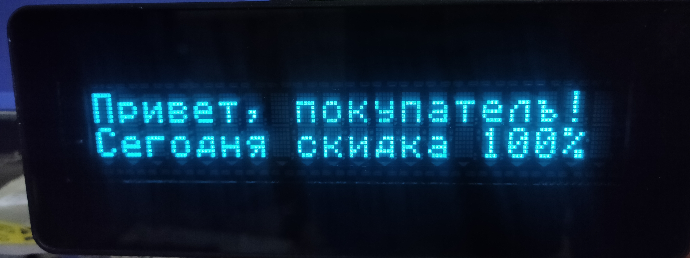

# VFD Customer Display Driver (2x20)

Библиотека на Python 3.10+ для управления вакуумно-флуоресцентными (VFD) текстовыми дисплеями покупателя с сеткой символов 2x20 в операционных системах семейства Linux (Debian, Ubuntu, Mint).

Проект предназначен для вывода любой текстовой информации, системных логов, статусов автоматизации или создания кастомных мониторов ресурсов (CPU/RAM).

## Возможности
* Полная поддержка кириллицы: Автоматическая перекодировка UTF-8 строк в кодовую страницу дисплея (CP866).
* Синхронизированный буфер: Библиотека хранит состояние экрана в памяти для корректного обновления.
* Удобный синтаксис: Поддержка обращения к строкам через индексы (vfd[0] = "Текст").
* Контекстный менеджер: Автоматическое открытие и безопасное закрытие последовательного порта (with).
* Встроенный Meter (Progress Bar): Готовый инструмент для отрисовки горизонтальных графиков (например, уровня загрузки) ровно на 20 символов строки.

## Требования к системе
* ОС: Linux Debian / Ubuntu
* Python: Версия 3.10 или выше
* Зависимости: Модуль pyserial

## Установка и настройка порта

1. Клонируйте репозиторий или скопируйте файлы проекта.
2. Установите зависимость для работы с COM-портом:
   ```bash
   pip install pyserial
   ```
3. При подключении дисплея к ПК устройство обычно регистрируется как /dev/ttyUSB0 (или /dev/ttyACM0). 
4. Важно: По умолчанию доступ к портам tty имеет только root. Чтобы запускать скрипт без sudo, добавьте своего пользователя в группу dialout:
   ```bash
   sudo usermod -a -G dialout $USER
   ```
   *После этого необходимо перезагрузить систему или перезайти в сессию.*

## Пример использования

Создайте файл main.py и используйте следующий код для вывода информации:

```python
import time
from VFDmod import VfdDisplay, SerialConn

# Путь к порту в Debian
PORT = '/dev/ttyUSB0'

try:
    # Инициализация транспорта и дисплея через контекстный менеджер
    with VfdDisplay(SerialConn(PORT, baud_rate=9600)) as vfd:
        vfd.initialize()  # Сброс дисплея и принудительное включение кириллицы
        vfd.clear()       # Очистка экрана

        # 1. Запись в строки через индексы (0 - верхняя, 1 - нижняя)
        vfd[0] = "Система Debian"
        vfd[1] = "Статус: Ок"
        time.sleep(3)

        # 2. Использование встроенного индикатора выполнения (Progress Bar)
        vfd.meter(label="CPU", value=45.5, index=0)
        vfd.meter(label="RAM", value=82.0, index=1)
        
        print("Данные успешно отправлены на дисплей. Нажмите Ctrl+C для выхода.")
        while True:
            time.sleep(1)

except KeyboardInterrupt:
    print("\nПрограмма завершена.")
except Exception as e:
    print(f"\nОшибка: {e}")
    print("Проверьте физическое подключение кабеля и права доступа к порту.")
```

## Структура классов
* SerialConn - отвечает за стабильное соединение с портом, обертку над pyserial и отправку сырых байт.
* POSDisplay - абстрактный класс, задающий логику двустрочного текстового буфера (размер сетки 2x20) и форматирование строк.
* EpsonProtocol - низкоуровневая реализация базовых команд управления курсором и очисткой.
* VfdDisplay - высокоуровневый класс для конечного пользователя (локализация, кодовые таблицы, метод meter).

## Demo

Вот небольшая шутка, отображаемая на экране для проверки работы и поддержки кириллической кодировки:



## Почему именно этот проект?

В отличие от громоздких библиотек для кассовых терминалов (например, `python-escpos`), этот проект создан для DIY-разработчиков:

* **Ничего лишнего (Zero-Overhead):** Максимально легкий код без тяжелых зависимостей и функций для печати чеков или генерации штрихкодов.
* **Чистая архитектура:** Логика протокола полностью отделена от транспортного уровня. Это позволит в будущем легко адаптировать либу под новые платформы.
* **Синтаксический сахар:** Обращение через индексы (`vfd[0] = "Текст"`) автоматически берет на себя управление курсором и дополнение строки пробелами.
* **Готовый мониторинг:** Функция `vfd.meter()` позволяет без лишних математических расчетов превратить дисплей в аккуратную панель статуса.
